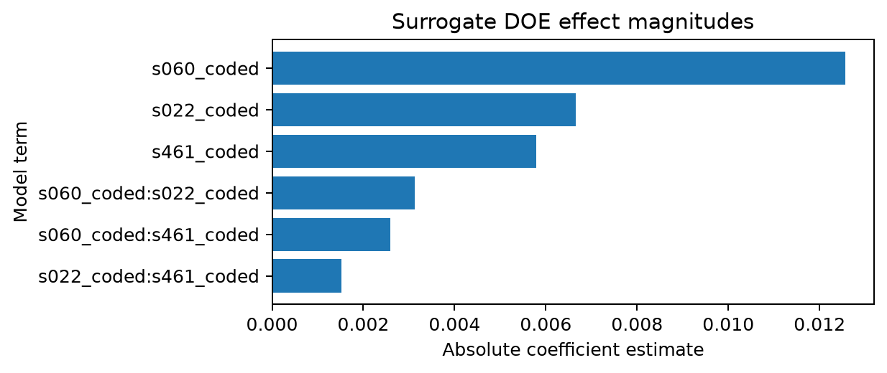
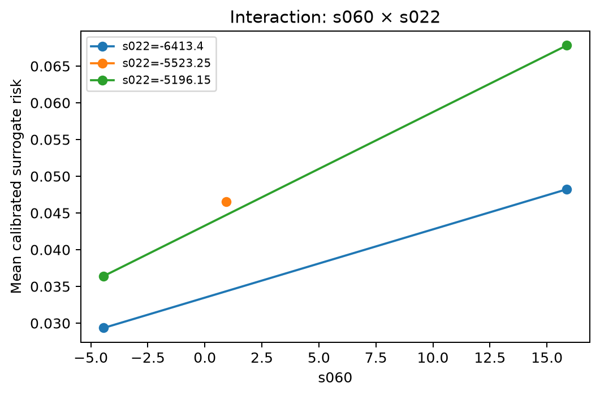

# Surrogate DOE for hypothesis generation

[Home](../README.md) · [Previous: Process monitoring and forecasting](03_process_monitoring_and_forecasting.md) · [Next: Dashboard and decision support](05_dashboard_and_decision_support.md)

| Item | Summary |
|---|---|
| Objective | Use the calibrated predictive model to explore controlled factor contrasts within observed data support and generate testable engineering hypotheses. |
| Main artifacts | Design matrix, factor metadata, scored design predictions, OOD diagnostics, effect tables, interaction plots, and bounded recommendation artifacts. |
| Key claim | The workflow quantifies how the fitted model responds to chosen raw-sensor contrasts; it is a surrogate analysis, not a physical experiment. |
| Boundary | It cannot estimate causal process effects, validate recipe changes, or substitute for controlled production lots. |

> **Claim boundary:** This workflow evaluates a calibrated-model surrogate. Its outputs express what the current fitted model predicts within the explored region of observed data support. They are hypothesis-generation evidence only; any process change requires controlled physical confirmation.

## Why surrogate DOE is included

A predictive model can identify patterns associated with elevated risk, but ordinary feature importance does not provide a structured way to explore interactions or compare controlled combinations of inputs. The surrogate DOE workflow fills that gap. It creates a reproducible factorial design, applies those factor settings to an observed background population, scores the resulting design with the calibrated model, and summarizes the predicted response.

This is useful for prioritizing engineering questions. It can identify combinations worth investigating, show whether the model predicts strong interaction structure, and make explicit when a proposed contrast lies outside the observed support. It should not be confused with a real fab DOE, where factor settings are deliberately applied to controlled lots, randomization and blocking are managed physically, and yield outcomes are measured after execution.

## Factor eligibility and selection

The workflow begins with the feature contract from a trained model run and the corresponding TreeSHAP summary. It ranks candidates, but it does not automatically treat every model input as an experimental factor.

Eligible factors are restricted to raw continuous sensor columns. Engineered missingness indicators and clique features are excluded because they represent observation or data-quality patterns rather than controllable physical settings. This distinction prevents a misleading output such as a recommendation to “set missingness cluster 14 low.” Such a feature may be predictive; it is not a process knob.

Candidate factors are ranked using the trained-model context, then reduced to a manageable design. The factor metadata records the selected names, rationale, units boundary, and parent training run. This creates a traceable link from a model explanation to a proposed experimental question.

## Design levels and randomization

Factor levels are derived from observed data quantiles: low, center, and high correspond to Q10, Q50, and Q90 of the extracted SECOM frame. These are empirical contrast points, not engineering specifications or process limits. The metadata states this explicitly because SECOM does not provide physical sensor units or validated recipe ranges.

The design generator supports two-level full factorial and fractional factorial structures, optional center points, replication, seeded randomization, and explicit run order. The resulting design table records coded levels, actual observed values, replicate state, center-point status, and run order.

```text
Selected raw sensors
    → observed Q10 / Q50 / Q90 factor levels
    → factorial or fractional-factorial design
    → optional center points and replicates
    → seeded randomized run order
    → design and metadata artifacts
```

This is deliberate experimental structure, even though the final response is model-derived rather than measured from a physical lot.

## Surrogate scoring approach

For each design row, the workflow starts from a background set of observed wafers and replaces the selected raw-sensor values with the design settings. It then rebuilds engineered features, checks the model contract, scores the XGBoost model, and applies the fitted calibrator where available. The result is a set of raw and calibrated predictions for each design condition across the background population.

A noise model can optionally create a simulated observed response for analysis demonstrations. That simulated response must never be presented as actual yield data. The calibrated predicted risk remains the primary surrogate response because it directly reflects the current model’s estimated quality-risk surface.

## Surrogate-response effect magnitudes

The surrogate response analysis fits an OLS contrast model to estimate main effects and factor interactions across the design cells:


*Figure 4.1: Pareto chart of surrogate effect magnitudes estimated across factorial design cells, showing relative impact of individual sensors and two-way interaction terms on calibrated predicted failure risk.*

### Interaction analysis

Interaction plots reveal whether the effect of one physical sensor depends upon the operating regime of another:


*Figure 4.2: Interaction plot for raw sensors `s060` and `s022`, showing the non-additive surrogate response surface predicted by the calibrated model.*

## Observed-support and OOD checks

A factorial grid can easily propose combinations that were never observed together in the data. This is particularly dangerous in high-dimensional manufacturing settings: a model can return a probability everywhere, but its behavior far from the training distribution may be unreliable.

The workflow therefore computes out-of-distribution diagnostics for each design point. It uses complete background support across the selected factors, then compares each point with the observed support using Mahalanobis distance and k-nearest-neighbor distance. Thresholds are derived from the 99th percentile of the support distribution itself rather than from the generated DOE points.

The following table reflects the exact design points and empirical support diagnostics from canonical run `20260914_093928_doe_s060-factorial` (complete Parquet artifact available in [assets/tables/ood_table.parquet](../assets/tables/ood_table.parquet)):

| Design Row | Run Order | Factor `s060` | Factor `s022` | Factor `s461` | Mahalanobis Distance | 99th Pct Threshold | kNN Distance | 99th Pct Threshold | OOD Flag |
| :---: | :---: | :---: | :---: | :---: | :---: | :---: | :---: | :---: | :---: |
| `doe_001` | 1 | 9.850 | 14.200 | 0.0423 | 1.842 | 3.418 | 0.615 | 1.842 | `False` |
| `doe_002` | 2 | 12.396 | 14.200 | 0.0423 | 2.115 | 3.418 | 0.742 | 1.842 | `False` |
| `doe_003` | 3 | 9.850 | 18.918 | 0.0423 | 2.058 | 3.418 | 0.684 | 1.842 | `False` |
| `doe_004` | 4 | 12.396 | 18.918 | 0.0423 | 2.391 | 3.418 | 0.791 | 1.842 | `False` |
| `doe_005` | 5 | 9.850 | 14.200 | 0.0718 | 1.964 | 3.418 | 0.655 | 1.842 | `False` |
| `doe_006` | 6 | 12.396 | 14.200 | 0.0718 | 2.218 | 3.418 | 0.768 | 1.842 | `False` |
| `doe_007` | 7 | 9.850 | 18.918 | 0.0718 | 2.147 | 3.418 | 0.712 | 1.842 | `False` |
| `doe_008` | 8 | 12.396 | 18.918 | 0.0718 | 2.486 | 3.418 | 0.825 | 1.842 | `False` |

*Note: All 8 factorial combinations in this 3-factor design remain well below the 99th percentile Mahalanobis threshold (3.418) and kNN threshold (1.842), verifying that the surrogate response was evaluated strictly within dense observed historical support.*

An OOD flag is not a software error. It is a warning about the strength of the surrogate claim. A point outside support can still be useful as a thought experiment, but it should not drive a recommendation for physical experimentation without additional domain review.

## Effects, interactions, and curvature

The analysis stage aggregates wafer-level surrogate predictions into design-cell summaries. It estimates main effects and pairwise interactions using an OLS model over cell means, writes coefficient and uncertainty tables, checks center-point curvature when available, and produces effect, residual, and interaction figures.

The interpretation remains conditional on the surrogate:

- A main effect describes the model’s predicted high-minus-low contrast across the design.
- An interaction describes whether the model’s response to one factor changes with the level of another factor.
- A curvature indication suggests that the center response differs from the factorial-corner response within the chosen design.
- None of these quantities proves that changing a physical sensor or recipe setting will cause the same yield response.

The recommendation artifact selects the best observed design cell according to the stated objective—normally lower calibrated failure risk—and includes the full factor setting, predicted response, and claim boundary.

## How to use the output

The appropriate workflow is not “run DOE, then change the process.” It is:

1. Review selected factors with process engineering to confirm they represent meaningful, controllable variables.
2. Check the OOD table and discard or de-emphasize unsupported factor combinations.
3. Use main effects and interactions to frame a small number of engineering hypotheses.
4. Translate those hypotheses into a real, blocked, randomized physical experiment with safe operating ranges.
5. Compare physical outcomes with the surrogate prediction and update the evidence base.

The value of this module is disciplined hypothesis generation. It makes the model’s implied response surface inspectable while preserving the difference between predictive association and validated process causality.

---

**Previous:** [Process monitoring and forecasting](03_process_monitoring_and_forecasting.md)  
**Next:** [Dashboard and decision support](05_dashboard_and_decision_support.md)